# Sanford Health/DSU Data Competition - Team No Sleep
### Introduction
Team No Sleep from South Dakota Mines by Joseph Coast, Angelo Cosato, Eric Johnson, Tammy Nguyen.  
This is Team No Sleep's submission for the Sanford Health/DSU Data Competition 2026. There are three components to the code: a Streamlit web app that allows the user to predict any given date or date range, a Jupyter notebook that contains our EDA, and finally a Jupyter notebook that has the many models we tried.  
The Streamlit app can be found [here](https://dsu-no-sleep.streamlit.app/).

## Approach / Methodology
### Correlation
The given dataset represents the ED volumes from four large Sanford Health emergency departments. This includes the total encounters and the number of encounters admitted to a floor. It's important to note that the number of encounters contains the number of admitted, so they are correlated.  

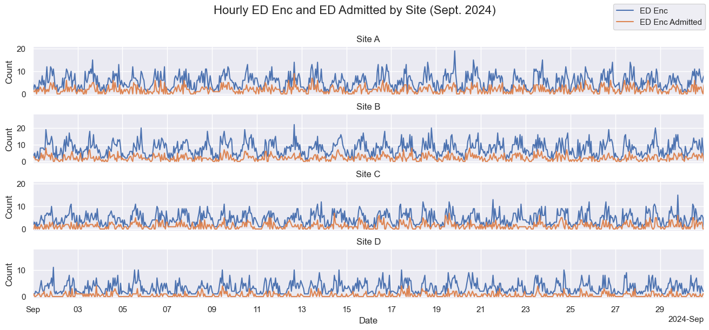
*Thus the number of admitted is stricly less than the number of encounters*  

If we take a look at the correlation matrix of the dataset, we get the following:  
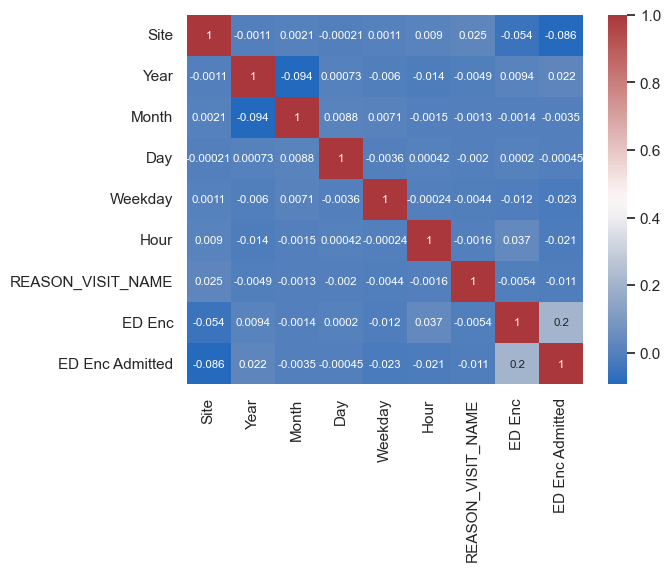  
And if we generate one for a daily aggregated dataset, we get a more interesting correlation matrix.  
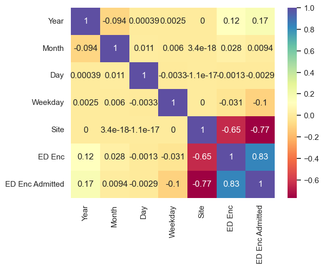  
We can see that the site is very correlated with the volume of encounters/admitted, and we can confirm that the volume of encounters and volume of admitted are in fact correlated.  

### Impact of COVID-19 Pandemic on Emergency Department Visits
Exploring the data, we can see there is a significant dip in 2020.
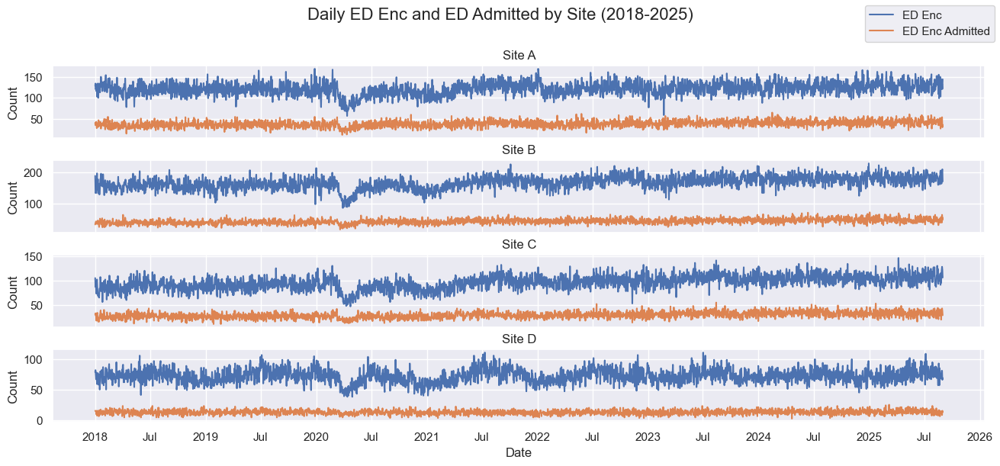
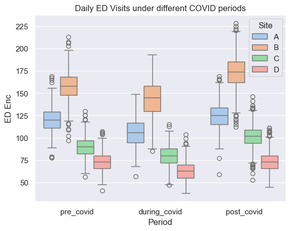 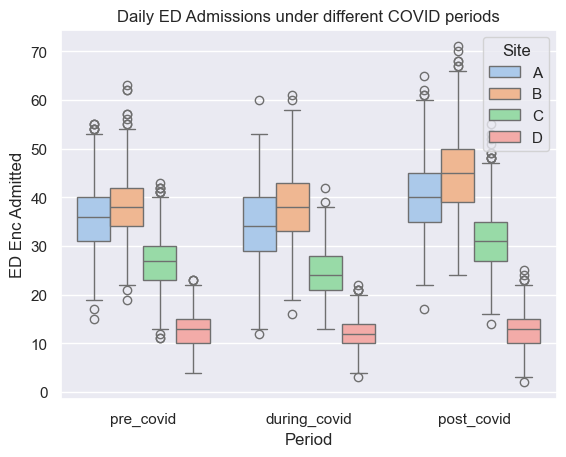
Not only is there a huge dip, but daily ED encounters increase after COVID, compared to pre-COVID.  
These periods are calculated as such:
- pre-COVID will be Jan. 1, 2018 up to March 13, 2020 (this was when state of emergency was declared in South Dakota, according to [Wikipedia](https://en.wikipedia.org/wiki/U.S._state_and_local_government_responses_to_the_COVID-19_pandemic))
- during COVID is March 13, 2020 to January 1st, 2020 (cases began to decline following the winter 2020 surge, according to [Keloland](https://www.keloland.com/keloland-com-original/looking-back-2-years-of-covid-19-in-south-dakota/))
- There was also an [Omicron surge](https://doh.sd.gov/press-releases/first-covid-19-omicron-variant-case-detected-in-south-dakota/) from December 22, 2021 to February 1st, 2021. We will extend "during COVID" period to February 1st for simplicity.
- February 1st, 2021 to August 31st, 2025 is post-COVID.

### Seasonal decomposition
Time series data can be decomposed into three types of time series patterns; trend-cycle, seasonality, residual. After we remove the outliers (these are data points with a z-score above 3, where z-score is $\frac{x-\mu}{\sigma}$), we get the following additive decompositions for August 2025. This uses moving averages.  
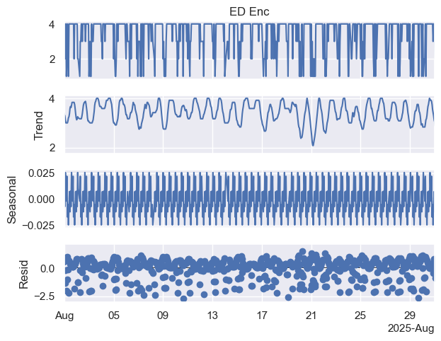 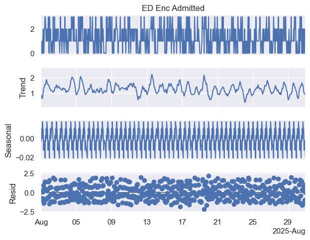  
The trend represents the underlying pattern. Seasonality represents repeating fluctuations caused by seasons or cycles. The residual is the remaining noise after the trend and seasonality is removed from the data. All three components can be added together to get the top graph.  
We can see that seasonality occurs regularly. Its magnitude is consistent at each peak/valley, but the magnitude is not particularly large. Additionally, its trend may be hard to predict.

### Model
We first considered that each site gets different volumes of traffic, so we made a model per site. Additionally, since ED Enc and ED Admitted are correlated, we want to use a multivariate regression model. Additionally, since the volume of ED visits changes after COVID, we will train the models on post-COVID data, AKA 2/1/2021-8/31/2025.  
Ultimately, the model we ended up choosing was CATboost. It was able to follow the trend well enough in its predictions, and it had as much variation/noise as the actual data did. And, most importantly, it accomplished this without terribly overfitting the data. Preferably, we should have used a time forecasting model such as ARIMA/SARIMA, but we could not get this working in time.
|                                                                 |                                                                 |
| ----------------------------------------------------------------|---------------------------------------------------------------- |
| *$R^2$ of 0.7292* 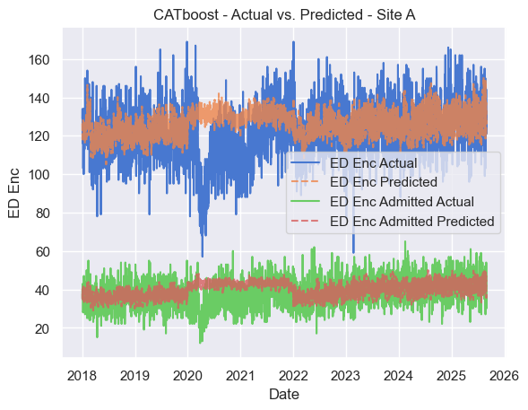 | *$R^2$ of 0.7958* 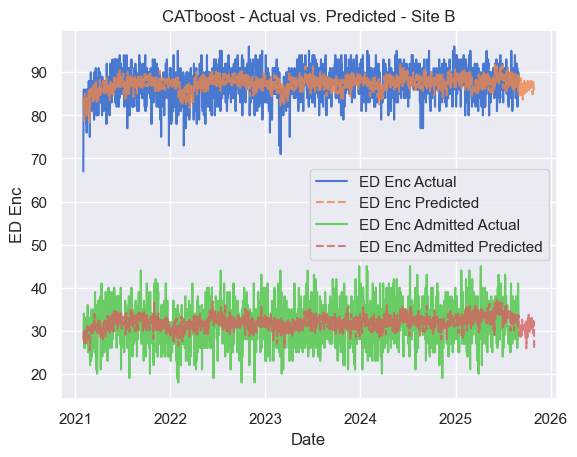 |
| *$R^2$ of 0.7078* 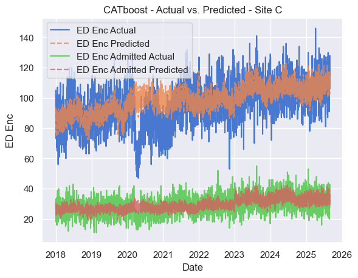 | *$R^2$ of 0.6467* 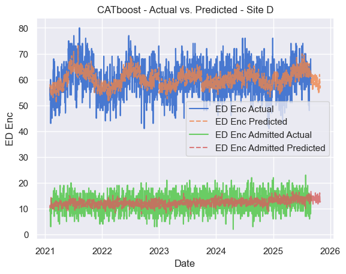 |